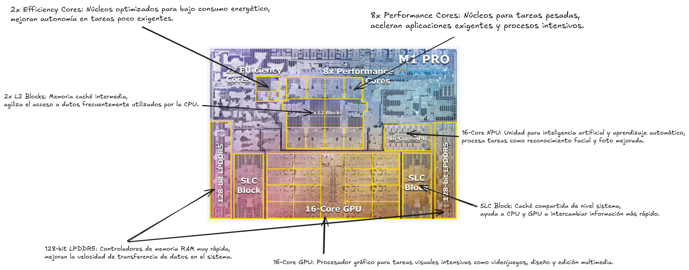
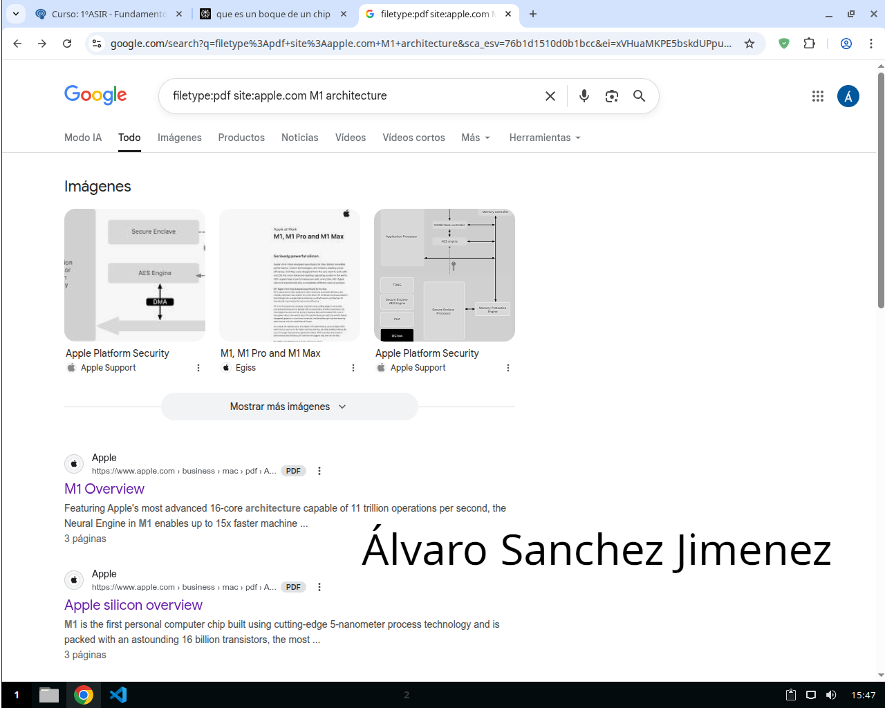
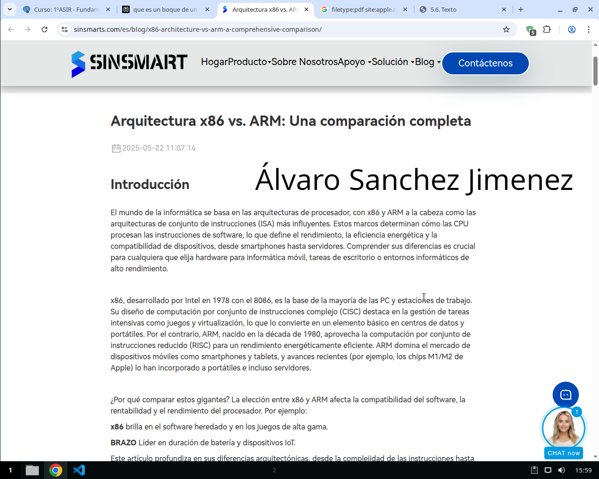
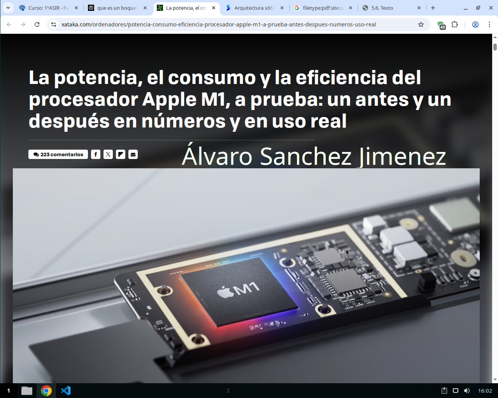

## Plantilla (copia y pega y rellena)

# Arquitectura moderna — A+B+C (sin lío de diagramas)

**Alumno/a:** Álvaro Sanchez Jimenez
**Grupo:** 1º ASIR
**Arquitectura elegida:** Apple M-series

- - -

## A) Básico — Qué es y para qué sirve (3–5 líneas)

* La serie M de Apple son sistemas en chip (SoC) diseñados por Apple para sus ordenadores Mac y
iPads, basados en la arquitectura ARM y centrados en la eficiencia y el alto rendimiento. Sirven para
potenciar dispositivos con mayor velocidad, mejor eficiencia energética (mayor duración de batería) y
capacidades avanzadas como el aprendizaje automático y el procesamiento de video, permitiendo a
Apple ser autosuficiente en la fabricación de sus procesadores y fusionar el rendimiento de los
dispositivos móviles con las computadoras.

### Representación visual

### CAPTURA 1 — Búsqueda avanzada

- - -

## B) Intermedio — Problema que mejora + comparativa

**Problema que mejora (1–2 líneas):** …

**Tabla comparativa (≥3 filas)**

| Aspecto | PC clásico monolítico | Arquitectura elegida |
| ------- | --------------------- | -------------------- |
| ISA (Instruction Set Architecture) | x86-64 (CISC): instruccionescomplejas de Intel/AMD, mayorconsumo energético y ciclos dereloj. | ARM v8.4-A (RISC): instrucciones simplesoptimizadas, mayor eficiencia energética, proceso de fabricación de 5 nm. |
| Memoria | RAM DDR4/DDR5 separada deVRAM dedicada, requiere copia dedatos entre CPU y GPU con mayorlatencia. | Memoria unificada LPDDR4X a 4266 MT/scompartida entre CPU (8 núcleos), GPU (7-8núcleos) y Neural Engine (16 núcleos), sinduplicación de datos. |
| Interconexión | Buses PCIe separados entre CPU,GPU discreta, chipset y RAM,múltiples controladoresindependientes. | SoC totalmente integrado con 16.000 millones detransistores, interconexión de alta velocidad entretodos los componentes en un único chip |
| Aceleradores | GPU dedicada (NVIDIA/AMD) oIntel UHD integrada básica, sinprocesador neural dedicado,aceleración limitada para IA/ML... | GPU integrada de 8 núcleos (hasta 24.576 hilos),Neural Engine de 16 núcleos (11 billones deoperaciones/segundo), ISP, aceleradoresmultimedia H.264/HEVC, Secure Enclave... |
| Objetivo principal | Máximo rendimiento bruto encargas sostenidas, gaming de altagama, flexibilidad de actualizacióny expansión. | Balance óptimo entre rendimiento y eficienciaenergética (10 horas autonomía), reducción decalor, rendimiento por vatio superior, ideal paraportátiles profesionales. |

> **Glosario**

* **SoC (System on Chip):** Sistema completo integrado en un solo chip que incluye CPU, GPU, memoria y otros componentes.
* **ISA (Instruction Set Architecture):** Conjunto de instrucciones que define cómo el procesador ejecuta operaciones.
* **CISC (Complex Instruction Set Computing):** Arquitectura con instrucciones complejas que realizan múltiples operaciones.
* **RISC (Reduced Instruction Set Computing):** Arquitectura con instrucciones simples y uniformes que se ejecutan en menos ciclos.
* **Memoria Unificada:** Memoria compartida accesible por todos los componentes del chip sin duplicación de datos.
* **Neural Engine:** Procesador especializado en operaciones de inteligencia artificial y aprendizaje automático.
* **Latencia:** Tiempo de retardo en el acceso y transferencia de datos entre componentes.

### CAPTURA 2 — Fuente oficial/técnica

- - -

## C) Curioso — Dato

**Dato:** El Neural Engine del Apple M1 es capaz de realizar 11 billones de operaciones por segundo,
procesando tareas de aprendizaje automático hasta 26 segundos más rápido que un MacBook Pro de 16"
con Intel i7, utilizando 12 veces menos consumo energético.

### CAPTURA 3 — Dato

## Fuentes

1. [https://es.wikipedia.org/wiki/Apple\_Silicon](https://es.wikipedia.org/wiki/Apple_Silicon)
2. [https://www.pcmag.com/encyclopedia/term/apple-m-series](https://www.pcmag.com/encyclopedia/term/apple-m-series)
3. [https://www.profesionalreview.com/2023/03/05/apple-m1-m2-chipset/](https://www.profesionalreview.com/2023/03/05/apple-m1-m2-chipset/)
4. [https://www.xataka.com/ordenadores/potencia-consumo-eficiencia-procesador-apple-m1-a-prueba-antes-despues-numeros-uso-real](https://www.xataka.com/ordenadores/potencia-consumo-eficiencia-procesador-apple-m1-a-prueba-antes-despues-numeros-uso-real)
5. [https://www.sinsmarts.com/es/blog/x86-architecture-vs-arm-a-comprehensive-comparison/](https://www.sinsmarts.com/es/blog/x86-architecture-vs-arm-a-comprehensive-comparison/)